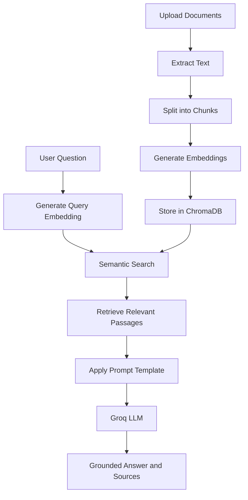

# DocuMind AI — Intelligent Knowledge Assistant

**An AI-powered document question-answering system built with Retrieval-Augmented Generation (RAG), semantic search, vector embeddings, and Large Language Models.**

DocuMind AI enables users to upload documents, ask natural-language questions, and retrieve context-aware answers grounded in their own knowledge sources. It combines a FastAPI backend, Sentence Transformers embeddings, ChromaDB vector storage, and Groq-powered language generation to provide an interactive document intelligence experience.

---

## Overview

Finding specific information across multiple documents can be time-consuming. DocuMind AI simplifies this process by transforming static documents into a searchable, interactive knowledge base.

Users can upload PDF, TXT, and Markdown files, retrieve semantically relevant passages, and ask questions in natural language. The system retrieves relevant context from the indexed documents and passes it to a language model to generate a grounded response.

The project also includes a **Prompt Engineering Lab** that compares Zero-shot, Few-shot, and Role-based prompting techniques using a shared set of benchmark questions.

## Key Features

* **Multi-Format Document Upload:** Upload PDF, TXT, and Markdown files, with a maximum file size of 15 MB per file.
* **Intelligent Text Processing:** Extract document content and divide it into overlapping text chunks for efficient retrieval.
* **Semantic Search:** Find relevant passages based on meaning rather than exact keyword matches.
* **Vector Embeddings:** Generate text embeddings using Sentence Transformers.
* **Persistent Vector Storage:** Store document embeddings and metadata in ChromaDB for reuse across application restarts.
* **Context-Grounded AI Answers:** Generate responses using retrieved document context through the Groq API.
* **Prompt Engineering Lab:** Compare Zero-shot, Few-shot, and Role-based prompting techniques.
* **Source-Aware Retrieval:** Display relevant passages, source document names, chunk information, and similarity estimates.
* **Interactive Web Interface:** Access document upload, question answering, and semantic search through a browser-based dashboard.
* **REST API:** Use dedicated endpoints for document indexing, retrieval, statistics, and prompt comparison.
* **Sample Knowledge Base:** Explore the application with five included sample documents.

## Technology Stack

| Category             | Technologies                             |
| -------------------- | ---------------------------------------- |
| Programming Language | Python                                   |
| Backend Framework    | FastAPI                                  |
| Language Model API   | Groq API                                 |
| LLM                  | Llama 3.3 70B Versatile (configurable)   |
| Embedding Model      | Sentence Transformers — all-MiniLM-L6-v2 |
| Vector Database      | ChromaDB                                 |
| PDF Processing       | PyPDF                                    |
| Frontend             | HTML, CSS, JavaScript                    |
| Templating           | Jinja2                                   |
| Configuration        | Python Dotenv                            |
| API Documentation    | FastAPI / Swagger UI                     |

## System Architecture

DocuMind AI follows a Retrieval-Augmented Generation workflow.



### How It Works

1. **Document Ingestion:** The user uploads supported documents through the web interface.
2. **Text Extraction:** The application extracts readable text from PDFs, TXT files, and Markdown files.
3. **Chunking:** The extracted text is split into manageable chunks with overlapping content to preserve context.
4. **Embedding Generation:** Sentence Transformers converts each chunk into a numerical vector.
5. **Vector Indexing:** ChromaDB stores the embeddings, text chunks, and document metadata in a persistent local database.
6. **Semantic Retrieval:** The user's question is embedded using the same model, and ChromaDB retrieves the closest matching passages.
7. **Contextual Generation:** The selected passages are inserted into the chosen prompt template and sent to the Groq language model.
8. **Answer Delivery:** The application returns the generated answer alongside retrieved source information.

## Project Structure

```text
DocuMind-AI/
├── app/
│   ├── __init__.py
│   ├── main.py
│   ├── rag.py
│   └── prompts.py
├── data/
│   ├── sample_ai_basics.txt
│   ├── sample_embeddings.txt
│   ├── sample_rag_workflow.txt
│   ├── sample_semantic_search.txt
│   ├── sample_vector_databases.md
│   └── uploads/
│       └── .gitkeep
├── static/
│   ├── script.js
│   └── style.css
├── templates/
│   └── index.html
├── .env.example
├── .gitignore
├── requirements.txt
└── README.md
```

## Getting Started

Follow these steps to run DocuMind AI locally.

### Prerequisites

* Python 3.11 or 3.12 recommended
* pip package manager
* Internet connection for the initial embedding model download and Groq API requests
* A Groq API key

### 1. Clone the Repository

```bash
git clone https://github.com/YOUR-USERNAME/DocuMind-AI.git
cd DocuMind-AI
```

Replace `YOUR-USERNAME` with your GitHub username and update the repository URL if your project uses a different name.

### 2. Create a Virtual Environment

**Windows PowerShell**

```powershell
python -m venv .venv
.\.venv\Scripts\Activate.ps1
```

### 3. Install Dependencies

```bash
python -m pip install --upgrade pip
pip install -r requirements.txt
```

### 4. Configure Environment Variables

Create a local `.env` file from the provided example.

```powershell
Copy-Item .env.example .env
```

Open `.env` and add your Groq API key.

```dotenv
GROQ_API_KEY=your_groq_api_key_here
GROQ_MODEL=llama-3.3-70b-versatile
EMBEDDING_MODEL=sentence-transformers/all-MiniLM-L6-v2
```

Obtain your API key from the Groq Console:

https://console.groq.com/keys

**Security:** Never commit your actual `.env` file, API keys, or other secrets to GitHub.

### 5. Run the Application

Start the FastAPI development server from the project root.

```bash
uvicorn app.main:app --reload
```

### 6. Open the Application

| Resource             | URL                         |
| -------------------- | --------------------------- |
| Web Application      | http://127.0.0.1:8000       |
| Interactive API Docs | http://127.0.0.1:8000/docs  |
| Alternative API Docs | http://127.0.0.1:8000/redoc |

Upload a few sample documents from the `data/` directory and start asking questions.

**First-run note:** Sentence Transformers downloads the embedding model on initial startup. Allow time for the download to finish.

## API Reference

DocuMind AI exposes REST endpoints for document management, question answering, semantic search, prompt comparison, and usage statistics.

| Method | Endpoint         | Description                                              |
| ------ | ---------------- | -------------------------------------------------------- |
| GET    | `/`              | Serves the web dashboard                                 |
| GET    | `/api/documents` | Lists stored uploaded documents                          |
| POST   | `/api/upload`    | Uploads and indexes documents                            |
| POST   | `/api/ask`       | Generates a context-grounded answer                      |
| POST   | `/api/search`    | Performs semantic retrieval without generation           |
| GET    | `/api/compare`   | Compares prompting techniques across benchmark questions |
| GET    | `/api/stats`     | Returns indexed chunk and document counts                |
| GET    | `/docs`          | Opens interactive Swagger API documentation              |

### Example: Ask a Question

**Request**

`POST /api/ask`

```json
{
  "question": "How does semantic search work?",
  "technique": "role_based",
  "top_k": 3
}
```

**Request fields**

* `question`: The question to answer.
* `technique`: The prompting method — `zero_shot`, `few_shot`, or `role_based`.
* `top_k`: The number of relevant passages to retrieve, from 1 to 10. The default is 3.

The response contains the generated answer, selected prompting technique, and retrieved source passages.

## Prompt Engineering Lab

A key feature of DocuMind AI is its built-in experiment for comparing different prompt engineering strategies.

### Supported Techniques

**1. Zero-shot Prompting**

Provides direct instructions without examples. It establishes a baseline for evaluating how a model responds to a task using only instructions and document context.

**2. Few-shot Prompting**

Includes example question-and-answer pairs to demonstrate the expected response style and format.

**3. Role-based Prompting**

Assigns the model the role of a careful technical document analyst, emphasizing factual accuracy, clear explanations, and answers grounded in the supplied context.

### Experimental Workflow

The Prompt Engineering Lab uses five benchmark questions and evaluates all three techniques, producing 15 generated answers.

| Evaluation Metric | Description                                              |
| ----------------- | -------------------------------------------------------- |
| Accuracy          | Whether the answer is supported by the source documents  |
| Clarity           | Whether the answer is understandable and well structured |
| Relevance         | Whether the answer directly addresses the question       |

To evaluate the techniques fairly, manually score each answer from 1 to 5 for every metric. Compare the average scores and record observations based on the actual results.

The application does not assume that any prompting technique is automatically superior; performance depends on the model, retrieved context, and question.

## Semantic Search and Embeddings

Traditional keyword search often depends on matching words or phrases. Semantic search instead compares numerical representations of text to identify passages with similar meaning.

DocuMind AI uses the `all-MiniLM-L6-v2` embedding model to encode document chunks and user queries. ChromaDB retrieves the nearest vectors using cosine distance.

The application displays a similarity estimate calculated as:

`similarity = 1 - cosine_distance`

This value is a ranking aid, not a calibrated probability of correctness. Retrieved passages may still be incomplete or irrelevant, so generated answers should be checked against their source documents.

## Configuration

The application supports environment-based configuration.

| Variable          | Purpose                                           |
| ----------------- | ------------------------------------------------- |
| `GROQ_API_KEY`    | Authenticates requests to the Groq API            |
| `GROQ_MODEL`      | Selects the language model                        |
| `EMBEDDING_MODEL` | Selects the Sentence Transformers embedding model |

The default embedding model and language model are configured in `.env.example`.

## Limitations

* Scanned or image-only PDFs may require OCR; OCR is not included.
* Generated answers depend on the quality and relevance of retrieved context.
* RAG reduces reliance on unsupported information but cannot guarantee that every answer is correct.
* The embedding model must be downloaded before it can be used for the first time.
* Prompt comparison sends 15 language-model requests and may consume API quota.
* The vector database and uploaded documents are stored locally.
* Manually deleting uploaded files does not automatically remove their indexed vectors from ChromaDB.

## Future Improvements

Potential extensions for future versions include:

* OCR support for scanned documents.
* Document deletion with synchronized vector-index cleanup.
* Authentication and user-specific knowledge bases.
* More advanced retrieval strategies and reranking.
* Evaluation dashboards with automated retrieval and answer-quality metrics.
* Source highlighting and document preview.
* Deployment with Docker and a cloud hosting platform.
* Automated tests and continuous integration.

## Learning Outcomes

This project demonstrates practical experience with:

* Retrieval-Augmented Generation (RAG)
* Embedding models and vector representations
* Semantic similarity search
* Persistent vector databases
* Prompt engineering and comparative evaluation
* LLM API integration
* REST API development with FastAPI
* Document ingestion and text preprocessing
* Environment configuration and API-key security
* Frontend and backend integration

## License

No formal open-source license is currently specified. Add a `LICENSE` file if you intend to distribute the project under a particular license.

---

**DocuMind AI — Turn your documents into an interactive knowledge base.**
